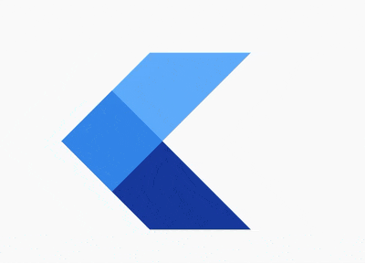

<h2 align="center">Hi 👋, I'm Kent J — A Passionate Full-Stack Developer from the Philippines</h2>

With over 3 years of experience in building robust, scalable, and secure web applications, I specialize in full-stack development, taking projects from concept to deployment. My expertise ranges from frontend frameworks like React and Angular, to backend technologies such as Node.js, Python, and Express. I thrive in challenging environments and am constantly learning to keep up with the ever-evolving landscape of software development.

  
  

### 🚀 **Frameworks & Tools**

I’ve worked extensively with a variety of frameworks and tools, and I continue to expand my knowledge in cutting-edge technologies. Here are some of the frameworks and tools I use:

  
  
  
  
  
  
  

 

 

### 🛠️ **Technologies & Tools**
- **Frontend:** React, Angular, Vue.js, Tailwind CSS, Material UI
- **Backend:** Node.js, Express, Python, Flask, Django
- **Databases:** PostgreSQL, MongoDB, MySQL
- **Version Control:** Git, GitHub, GitLab
- **CI/CD:** Jenkins, Docker, Kubernetes
- **Cloud Services:** AWS, Firebase, Heroku
- **Testing:** Jest, Mocha, Cypress
- **Methodologies:** Agile, Scrum, Test-Driven Development (TDD)

 

  
  
  
  
  
  
  
  
  
  
  
  
  

 

### 🌍 **My Development Journey**
Here's a quick overview of my journey so far:

- **2018:** Started my career as a junior web developer at [Company Name], where I built e-commerce sites.
- **2020:** Transitioned into full-stack development, contributing to large-scale enterprise applications at [Company Name].
- **2022:** Focused on scaling microservices architecture, working with AWS Lambda, Docker, and Kubernetes at [Company Name].

My passion for learning keeps me exploring new technologies. I am currently diving deep into [specific new technologies you’re learning, e.g., AI, Blockchain, etc.].

 

### 🚀 **Past Projects**

Below are some of the projects I’ve worked on. These reflect my diverse skill set and problem-solving abilities:

- [**Project 1**](#) - **Full-Stack E-Commerce Platform**
  - **Tech Stack:** React, Node.js, MongoDB
  - Developed a highly responsive and secure shopping cart with user authentication and order management.
  - Integrated Stripe for payment processing and implemented RESTful APIs for efficient backend communication.

- [**Project 2**](#) - **Personal Finance Tracking Tool**
  - **Tech Stack:** TypeScript, Express.js, PostgreSQL
  - Enabled users to set budgets, track expenses, and generate financial reports.
  - Built with a focus on real-time updates and data security.

- [**Project 3**](#) - **Real-Time Messaging App**
  - **Tech Stack:** React, Socket.io, Firebase
  - Developed dynamic chat rooms and real-time notifications for instant communication.
  - Deployed with Firebase to ensure scalability and speed.

- [**Project 4**](#) - **Portfolio Website**
  - **Tech Stack:** HTML, CSS, JavaScript
  - A clean and interactive portfolio website to showcase my skills, projects, and professional achievements.

- [**Project 5**](#) - **Task Management App**
  - **Tech Stack:** Python, Flask
  - Built an app to manage tasks with priority levels, deadlines, and team collaboration features.

Feel free to explore these projects to get a sense of my work and expertise.

 

### 💬 **What People Say About Me**
> "Kent is a highly skilled developer with an exceptional ability to solve problems. He built our e-commerce platform and we couldn’t be happier with the results!" – [Client Name]

> "His attention to detail and ability to work in a fast-paced environment has been invaluable to our team. Highly recommended!" – [Colleague Name]

 

### 📬 **Let’s Connect!**

I love connecting with other developers, entrepreneurs, and innovators. Reach out to me via any of these platforms:

- **YouTube:** Watch my tech tutorials and coding tips! [YouTube Link]
- **Instagram:** Follow me for development insights and behind-the-scenes. [Instagram Link]
- **LinkedIn:** Let’s connect professionally! [LinkedIn Link]
- **Email:** Drop me a message at [kentj@example.com](mailto:kentj@example.com)

 

### 💡 **My Philosophy**

I believe in the power of clean code and continuous learning. Outside of coding, I enjoy [briefly mention hobbies like reading tech blogs, participating in hackathons, or contributing to open-source projects]. I’m constantly looking for ways to improve my craft and help others in the tech community.

If you’d like to collaborate or learn from each other, let’s connect! 🌱
